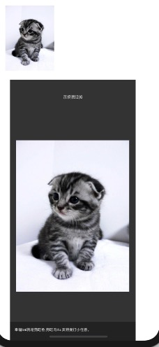
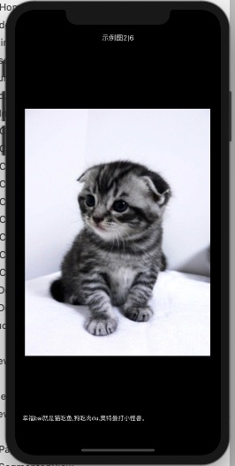

# CyImageBrowser 本品依赖于 SDWebImage

* 图片浏览器，支持缩放 ，拖动消失、双击放大等，支持桥接swift 语言

# ！！ 支持 cocoapod 安装
```
	pod 'LGCyImageBrowser'

```
>  如果找不到请用 'pod repo update' 命令 更新本地仓库

# 效果图




# 在swift 中使用方法 

```
桥接 bridge.h 中
…………

#import "CyImageBrowser.h"

…………

```
# OC 创建和使用
```

	CyImageBrowser *brower =[CyImageBrowser cyImageBrower];
	brower.isShowInformation = YES;//是否显示图片详情
//	[brower setMakePageLable:^(UILabel * _Nonnull pageLable) {
//		pageLable.frame = CGRectMake(0, MAINScreenHeight - 40, MAINScreenWidth, 30); //自定义控件位置
//	}];

	[brower setChangePageFormart:^(UILabel * _Nonnull pageLable, NSInteger page, NSInteger totalCount) {
		//进行格式化 标题的
		pageLable.text = [NSString stringWithFormat:@"示例图 %@ | %@",@(page + 1),@(totalCount)];
	}];

	[brower setChangePageInfo:^(UIView * _Nonnull infoView, CyBrowerInfo * info) {
		UITextView *titleLable =  [infoView viewWithTag:100];
		if (!info.imgInfo) {
			infoView.hidden = YES;
		}else{
			infoView.hidden = NO;
		}
		titleLable.text =  info.imgInfo;
	}];

	//设置详情的View
	[brower setMakeInfoView:^(UIView * _Nonnull infoView) {
		//info View 内容的View
		infoView.userInteractionEnabled = YES;
		infoView.frame = CGRectMake(0, CGRectGetHeight(self.view.frame) - 100, CGRectGetWidth(self.view.frame), 100);
		infoView.backgroundColor = [[UIColor blackColor]colorWithAlphaComponent:0.35];
		UITextView *lable =[UITextView new];
		lable.backgroundColor = [UIColor clearColor];
		lable.font = [UIFont systemFontOfSize:14.0f];
		lable.tag = 100;
		lable.textColor = [UIColor whiteColor];
		lable.editable = NO;
		[infoView addSubview:lable];
		[lable mas_makeConstraints:^(MASConstraintMaker *make) {
			make.edges.mas_equalTo(UIEdgeInsetsMake(10, 10, 10, 10));
		}];
	}];

	NSArray *urls = @[
	@"https://timgsa.baidu.com/timg?image&quality=80&size=b9999_10000&sec=1598598749779&di=434d63d3ab1874918cd8a92b9dea7b8d&imgtype=0&src=http%3A%2F%2Fb-ssl.duitang.com%2Fuploads%2Fitem%2F201703%2F21%2F20170321130742_iz4Tv.thumb.700_0.jpeg",	@"https://timgsa.baidu.com/timg?image&quality=80&size=b9999_10000&sec=1598531420951&di=99bf3923f9d220114425136e1f2d9252&imgtype=0&src=http%3A%2F%2Fa1.att.hudong.com%2F05%2F00%2F01300000194285122188000535877.jpg",
	@"https://ss3.bdstatic.com/70cFv8Sh_Q1YnxGkpoWK1HF6hhy/it/u=3690672463,4117611042&fm=26&gp=0.jpg",
		@"https://ss3.bdstatic.com/70cFv8Sh_Q1YnxGkpoWK1HF6hhy/it/u=3188859226,695738267&fm=26&gp=0.jpg",
	@"https://timgsa.baidu.com/timg?image&quality=80&size=b9999_10000&sec=1598599190512&di=225d278a317d021794ef8d16db5afa33&imgtype=0&src=http%3A%2F%2Fimg3.imgtn.bdimg.com%2Fit%2Fu%3D1525173583%2C3452221429%26fm%3D214%26gp%3D0.jpg",	@"https://timgsa.baidu.com/timg?image&quality=80&size=b9999_10000&sec=1598597130767&di=29b58216afe1bb3e5e4ecf85a0a5e2f0&imgtype=0&src=http%3A%2F%2Fimg3.imgtn.bdimg.com%2Fit%2Fu%3D1094758473%2C542124930%26fm%3D214%26gp%3D0.jpg",
	@"yqhy_kuang2_img",	[UIImage imageNamed:@"hone_banner_img"]
	];

	NSArray *imgMSgs = @[
		@"上午离家下午回，声音未改肤已黑。夫妻相见不相识，笑问黑蛋你找谁？",
		@"幸福bai就是猫吃鱼,狗吃肉du,奥特曼打小怪兽。",
		@"如果喜欢是性感猫咪 ，那爱本该是温柔野兽。",
			@"我是一bai只可怜的流浪猫,请领养我回家。",
		@"唯美的意思是追求绝对的美，但真正意义上的唯美并不存在于这个世界。 唯美提倡“为艺术而艺术",	@"当夜幕降临,小花猫就显得特别bai精神,它瞪着圆圆的大眼du睛守在老鼠家的门zhi口静静地等待着,一有目标出现,小猫会一下子扑过去死死地捉住,然后美餐一顿.",
		@"小花猫特别贪睡,一天到晚总是眯着眼睛打盹,可是睡觉时它的耳朵特别灵敏,只要有声音它的耳朵就会动一下,如果有人走进它,它会突然站起来.小花猫爱清洁讲卫生,经常用舌头舔身子,除去身上的脏物,小花猫从来不随地大小便.在奶奶家的房前有一棵弯弯的小树成了小花猫游玩的地方,它喜欢爬到树上然后又从上面跳下来,真是个小调皮"
	];

	CyBrowerInfos *infos = [CyBrowerInfos new];
	infos.currentIndex = 2;


	NSMutableArray *m = [@[] mutableCopy];
	for (int i = 0; i< urls.count; i++) {
		CyBrowerInfo *info = [CyBrowerInfo new];
		info.showView = _imgView;
		info.image =urls[i];
		if (imgMSgs.count > i) {
			info.imgInfo = imgMSgs[i];
		}
		m[i] = info;
	}
	infos.items = m;
	[brower showBrowerInfos:infos];

```


# swift 创建和使用
```
import UIKit
import SnapKit

class ImgBrowViewController: UIViewController {

	lazy var img_view: UIImageView = {
		let imgV = UIImageView()
		imgV.contentMode = .scaleAspectFit
		return imgV
	}()
    override func viewDidLoad() {
        super.viewDidLoad()
		view.backgroundColor = .white
		let button = UIButton(type: .custom)
		button.backgroundColor = .red
		button.addTarget(self, action: #selector(showImgBrowClicked), for: .touchUpInside)
		view.addSubview(button)


		view.addSubview(img_view)

		img_view.sd_setImage(with: URL(string: "https://timgsa.baidu.com/timg?image&quality=80&size=b9999_10000&sec=1598531420951&di=99bf3923f9d220114425136e1f2d9252&imgtype=0&src=http%3A%2F%2Fa1.att.hudong.com%2F05%2F00%2F01300000194285122188000535877.jpg"), completed: nil)

		img_view.snp.makeConstraints { (m) in
			m.height.equalTo(300.f_pt)
			m.width.equalTo(300.f_pt)
			m.top.equalTo(80.f_pt)
		}


		button.snp.makeConstraints { (m) in
			m.size.equalTo(CGSize(width: 150.f_pt, height: 150.f_pt))
			m.center.equalTo(view)
		}
    }

	@objc func showImgBrowClicked(btn:UIButton){

		let brower = CyImageBrowser.cyImageBrower()
		brower.isShowInformation = true
		brower.changePageFormart =   { (pageLable:UILabel,page:Int,totalCount:Int)->Void in
			pageLable.text = "示例图" + String(page + 1) + "|" + String(totalCount)
		}

		brower.changePageInfo = { (infoView:UIView,info:CyBrowerInfo)->Void in
			if let titleLable:UITextView = infoView.viewWithTag(100) as? UITextView {
				if info.image != nil {
					infoView.isHidden = false
				}else{
					infoView.isHidden = true
				}
				titleLable.text = info.imgInfo as?String
			}
		}

		brower.makeInfoView = {(infoView:UIView)->Void in
			infoView.isUserInteractionEnabled = false
			infoView.frame = CGRect(x: 0, y: self.view.frame.height - 100, width: self.view.frame.width, height: 100)
			infoView.backgroundColor = UIColor.black.withAlphaComponent(0.35)
			let textView = UITextView()
			textView.tag = 100
			textView.textColor = .white
			textView.backgroundColor = .clear
			textView.isEditable = false
			infoView.addSubview(textView)
			textView.snp.makeConstraints { (m) in
				m.edges.equalTo(UIEdgeInsets(top: 10, left: 10, bottom: 10, right: 10))
			}
		}

		let imgs = ["https://timgsa.baidu.com/timg?image&quality=80&size=b9999_10000&sec=1598598749779&di=434d63d3ab1874918cd8a92b9dea7b8d&imgtype=0&src=http%3A%2F%2Fb-ssl.duitang.com%2Fuploads%2Fitem%2F201703%2F21%2F20170321130742_iz4Tv.thumb.700_0.jpeg","https://timgsa.baidu.com/timg?image&quality=80&size=b9999_10000&sec=1598531420951&di=99bf3923f9d220114425136e1f2d9252&imgtype=0&src=http%3A%2F%2Fa1.att.hudong.com%2F05%2F00%2F01300000194285122188000535877.jpg","https://ss3.bdstatic.com/70cFv8Sh_Q1YnxGkpoWK1HF6hhy/it/u=3690672463,4117611042&fm=26&gp=0.jpg","https://ss3.bdstatic.com/70cFv8Sh_Q1YnxGkpoWK1HF6hhy/it/u=3188859226,695738267&fm=26&gp=0.jpg","https://timgsa.baidu.com/timg?image&quality=80&size=b9999_10000&sec=1598599190512&di=225d278a317d021794ef8d16db5afa33&imgtype=0&src=http%3A%2F%2Fimg3.imgtn.bdimg.com%2Fit%2Fu%3D1525173583%2C3452221429%26fm%3D214%26gp%3D0.jpg","https://timgsa.baidu.com/timg?image&quality=80&size=b9999_10000&sec=1598597130767&di=29b58216afe1bb3e5e4ecf85a0a5e2f0&imgtype=0&src=http%3A%2F%2Fimg3.imgtn.bdimg.com%2Fit%2Fu%3D1094758473%2C542124930%26fm%3D214%26gp%3D0.jpg"]


		let imgMSgs = ["上午离家下午回，声音未改肤已黑。夫妻相见不相识，笑问黑蛋你找谁？",
		"幸福bai就是猫吃鱼,狗吃肉du,奥特曼打小怪兽。",
		"如果喜欢是性感猫咪 ，那爱本该是温柔野兽。",
			"我是一bai只可怜的流浪猫,请领养我回家。",
		"唯美的意思是追求绝对的美，但真正意义上的唯美并不存在于这个世界。 唯美提倡“为艺术而艺术",	"当夜幕降临,小花猫就显得特别bai精神,它瞪着圆圆的大眼du睛守在老鼠家的门zhi口静静地等待着,一有目标出现,小猫会一下子扑过去死死地捉住,然后美餐一顿.",
		"小花猫特别贪睡,一天到晚总是眯着眼睛打盹,可是睡觉时它的耳朵特别灵敏,只要有声音它的耳朵就会动一下,如果有人走进它,它会突然站起来.小花猫爱清洁讲卫生,经常用舌头舔身子,除去身上的脏物,小花猫从来不随地大小便.在奶奶家的房前有一棵弯弯的小树成了小花猫游玩的地方,它喜欢爬到树上然后又从上面跳下来,真是个小调皮"]

		let browerInfos = CyBrowerInfos()
		browerInfos.currentIndex = 1
		var temArr = Array<CyBrowerInfo>()
		for i in 0..<imgs.count {
			let  info = CyBrowerInfo()
			info.image = imgs[i]
			info.showView = img_view
			if (imgMSgs.count > i) {
				info.imgInfo = imgMSgs[i];
				temArr.append(info)
			}
		}
		browerInfos.items = temArr
		brower.show(browerInfos)
	}
}


```


